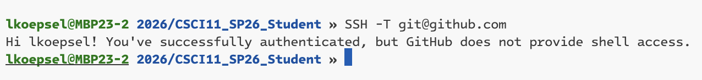
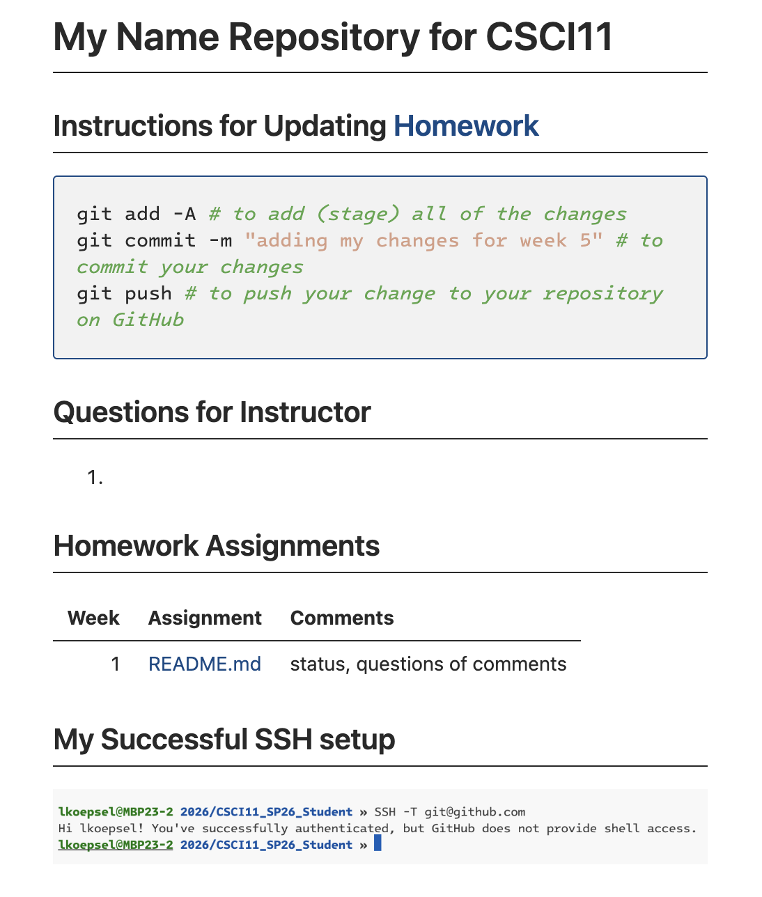

# README.md

This will become your homework repository for this class. 
## Instructions
Follow these instructions, to properly setup your repository for this class:
### 1. You must have a github.com account (*duh*)
### 2. To make your life easier, [add your public key](./ssh.md).
 So you have *SSH* access. To ensure you have it, I want to see **an image on this page** of you using `SSH -T git@github.com`, this will confirm you have SSH access. It needs to look like this: 
### 3. You must [clone this repository](./git.md) to your computer (school or personal). This repository will be where you turn in your homework.
### 4. Once cloned and changes made, you will need to `stage -> commit -> push`, so I will be able to review your work.
### 5. Add me as a collaborator and **keep your repository private.**
### 6. Edit this page in [Markdown](./markdown.md), so it looks identical to this image. There are detailed instructions below this image.
 . 
#### Steps to fix the README:
1. Change *My Name* to your name.  
2. Add a bash code block with the instructions shown, these will remind you what you need to do to turn in your homework.
3. Match the heading levels:
    * **README**.md is H1
    * **Questions...**, **Homework...**, and **My Successful...** are H2
4. In the heading **Instructions...Homework**, the word "Homework" is a link to local file homework.md
4. The table is created using a markdown table:
    * **Week** numbers are right-justified
    * **Assignments** are centered
    * **Comments** are left-justified
5. The entry for each week in the column **Assignment** is a hyperlink to the assignment file
6. You will need to use an image link to show your successful ssh png image.
6. Remove all of the instructional content, so that your README looks almost exactly like the image. The only differences are your name will appear where my name is in the image.

