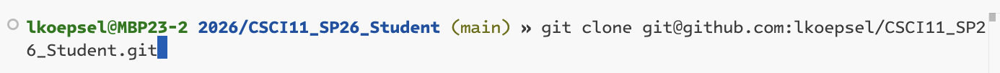
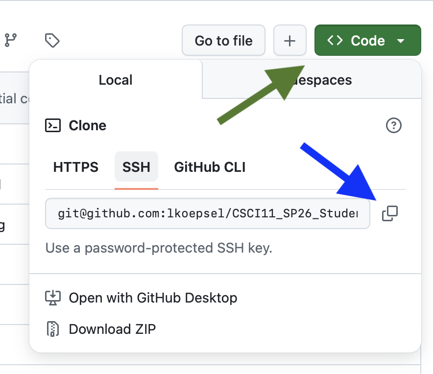

# Github Documentation for CSCI11 Spring 2026


## Important
Repositories for students to exchange homework with the instructor.

For *CSCI11 Spring 2026*, there are **two** repositories:
* *[CSCI11_Sp26_Instructor](https://github.com/lkoepsel/CSCI11_Sp26_Instructor)* - one repository, which will be the same for **all** students. It is *public* and hosted on *github.com/lkoepsel*. It contains the assignments for each week.
* *[CSCI11_Sp26_Student](https://github.com/lkoepsel/CSCI11_Sp26_Student)* - a clone of this repository for **each** student, it will be private and hosted on *github.com/student_username*. It contains each student's work on the weekly assignments.

### PLEASE NOTE:
1. **Please make sure your version of the student repository (*CSCI11...Student*) on GitHub is private and is accessible by only the instructor and you.**
2. **Please do NOT make changes or add files to the *CSCI11...Instructor* folder, as this is where you will receive new versions of files from the instructor**

## Installation

### 1. Clone this repository

Before starting, it will be helpful to review this image of the completed commands below.




1. Open a Terminal session in VS Code, using *Terminal -> New Terminal*.
   1. Enter `cd` to ensure you are in your home directory
   2. Enter `pwd` to show the path of your directory, write it down so you are aware of it
   3. If you wish, you may go to a specific directory in your home folder by entering `cd Documents` or `cd MyDocuments`
   4. **What is important is to know where you are going to store this repository.**
1. Setup your screen so half of the screen is VS Code and the other half is your browser.
1. Open anthor tab in your browser by right-clicking on this link [CSCI11_Sp26_Student](https://github.com/lkoepsel/CSCI11_Sp26_Student) and select on in *Open Link in New Tab*.
2. In the new tab, click on the Green Code button. *See green arrow.*
3. CLick on the double boxes at the end of the "*git@github....*" *See blue arrow*.
. 
4. In a terminal session in VS Code, enter `git clone ` and paste the address following the word *clone*, ensuring there is a space between *clone* and the address. Press *return*.
5. In the Terminal, enter `cd CSCI11_Sp26_Student` to enter the directory.

### 2. Create your **remote** repository in your **Github** account.

   1. **In your Github account**, make sure your are logged in and click on Repositories, then click the green button New.
   

   2. Fill in the name of the repo to be exactly the same as the one you have cloned: CSCI11_Sp26_Student
   *Note, I left off the "t" for the image, otherwise I'd have an error,*
   Be sure to make the repository Private, all other boxes will stay the same then click on the green button Create Repository
   


### 3. Connect your **local** repository to your **Github** repository.

Perform the four commands below, **one by one**, ensuring there is **NOT** an error, before going to the next step:
   1. Remove the original connection, if the result is "*error: No such remote: origin*", this is fine:
```bash
git remote remove origin
```

   2. Add the origin which will point to *your* GitHub account, so you will **need to change username**:

```bash
git remote add origin git@github.com:username/CSCI11_Sp26_Student.git
```

   3. Add the branch, *main*:
```bash
git branch -M main
```

#### Important: For Step 4 to be successful, two things must be true:
1. You must have successfully [added your public key](./ssh.md) to your settings on github. Confirm with `ssh -T git@github.com`
2. Your origin must be correct. Confirm with `git remote -v` and it must respond with:
```bash
origin  git@github.com:studentname/CSCI11_SP26_Student.git (fetch)
origin  git@github.com:studentname/CSCI11_SP26_Student.git (push)
```

   4. Push the local branch *main* to your Github repository:
```bash
git push -u origin main
```

   5. You will need to configure your name and email address before attempting to commit any changes to your repository. Be sure to change the email address to your address and the name to your name.

```bash
git config --global user.name "John Doe"
git config --global user.email johndoe@example.com
```

### Complete Terminal Session
Your session will look almost the same as the one below. The last commmand will have a different response, as you will be updating your repo and not mine.


Your response on the last command will be similar to:
```bash
Enumerating objects: 74, done.
Counting objects: 100% (74/74), done.
Delta compression using up to 4 threads
Compressing objects: 100% (42/42), done.
Writing objects: 100% (74/74), 1.46 MiB | 15.25 MiB/s, done.
Total 74 (delta 34), reused 69 (delta 32), pack-reused 0 (from 0)
remote: Resolving deltas: 100% (34/34), done.
To github.com:lkoepsel/CSCI11_SP26_Student.git
 * [new branch]      main -> main
branch 'main' set up to track 'origin/main'.
```

### Go back to the main page and complete the rest of the assignment by updating the README

## Links

* [Great resource on Git](https://git-scm.com/book)
